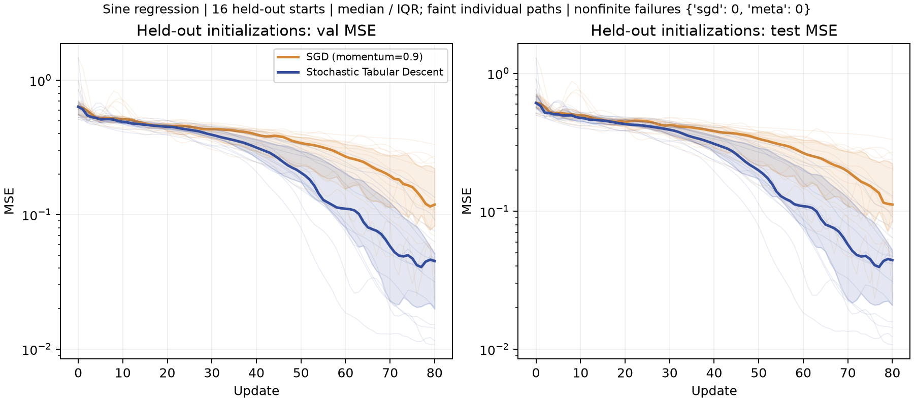

# Stochastic Tabular Descent

**Can a tabular foundation model learn to optimize a neural network, entirely in context?**

Stochastic Tabular Descent (STabD) turns optimizer learning into a tabular regression problem
for [TabPFN v3.5](https://priorlabs.ai). An expensive teacher (a validation-guided beam search
over minibatch steps) trains many small networks. Every step it takes becomes a table row. At
test time, TabPFN reads that table as its context and predicts, one step at a time, how to
correct a fresh minibatch gradient toward what the teacher would have done. No weights are
trained: TabPFN is used purely through in-context learning.



*Validation (left) and test (right) MSE of a 1→10→10→1 ReLU network fitting y = sin(x), from
16 held-out random initializations. Thick line: median; band: interquartile range; faint lines:
individual runs.*

## Idea

1. **Teacher.** Beam search over optimizer steps. At each step, every kept network proposes
   32 minibatch gradients, each tried at 3 step sizes (×0.5, ×1, ×2), all with momentum. The
   16 children with the lowest *validation* loss survive. The winning path is traced back, and
   each of its steps becomes one row of the context.
2. **Context.** Each row describes a training state (parameters, a fresh minibatch gradient,
   the momentum buffer) and the teacher's chosen gradient.
3. **Policy.** For each of the network's 141 parameters, TabPFN regresses the *residual*
   between the teacher's gradient and the observed gradient. The update is SGD with momentum,
   applied to `observed gradient + predicted residual`. If TabPFN learns nothing, the policy
   falls back to plain SGD.
4. **Evaluation.** Fresh initializations the teacher never saw. STabD makes one minibatch
   gradient call per step, the same budget as SGD. It never sees validation or test loss.

### Pseudocode

```text
# 1. Teacher: validation-guided beam search (run once, offline)
for each of 512 random initializations θ₀:
    beam ← {(θ₀, v = 0)}
    repeat 80 times:
        children ← {}
        for (θ, v) in beam:
            for 32 minibatches B:
                g ← ∇L_B(θ)
                for s in {0.5, 1, 2}:
                    v' ← μ·v + s·g ;  θ' ← θ − η·v'
                    children ← children ∪ {(θ', v', parent = (θ, v), step = s·g)}
        beam ← 16 children with lowest validation loss
    trace the best final child back to θ₀; for each (θ, v, step) on that path:
        g_obs ← ∇L_B'(θ) on a fresh minibatch B'
        add row  features = [θ, g_obs, v],  target = step − g_obs

# 2. STabD: in-context learned optimizer (no training)
fit 141 TabPFN regressors, one per parameter, on the rows (one shared backbone)
for a new initialization θ, with v = 0:
    repeat 80 times:
        g_obs ← ∇L_B(θ) on a fresh minibatch B
        g ← g_obs + TabPFN([θ, g_obs, v])   # predicted residual, per coordinate
        v ← μ·v + g ;  θ ← θ − η·v
```

### Features

| Feature | Size | Meaning |
|---|---|---|
| θ | 141 | Current weights and biases of the network |
| g_obs | 141 | A fresh minibatch gradient at θ (the same kind of signal SGD uses) |
| v | 141 | Momentum buffer before the step |
| **Target** | 141 (one TabPFN model each) | Teacher's chosen gradient minus g_obs |

The script also supports `--features theta` (parameters only, predicting the whole gradient)
and `--features grad` (parameters and gradient, no momentum buffer).

## Configuration tested

| Setting | Value |
|---|---|
| Task | y = sin(x), x ~ U[−5, 5]; 256 train / 512 validation / 2048 test points |
| Network | 1 → 10 → 10 → 1, ReLU, 141 parameters, PyTorch-style uniform initialization |
| Optimizer dynamics | Learning rate η = 0.01, momentum μ = 0.9, batch size 32, 80 steps |
| Teacher | 512 trajectories; beam width 16; 32 minibatches × 3 step scales per beam node |
| Context | 40,960 rows × 423 features; 141 independent regression targets |
| Model | TabPFN v3.5 (`tabpfn` 9.0.0), 1 estimator, `fit_preprocessors` mode |
| Evaluation | 16 held-out initializations; test data never used for any selection |
| Compute | Teacher: about 2 h on 4 CPU cores. STabD rollout: 18.2 h on one A100 80 GB (about 5 GB GPU memory, 26 GB host RAM) |

## Results

Median test MSE after 80 steps, over 16 held-out initializations:

| Method | Gradient calls per step | Test MSE | Better than SGD |
|---|---|---|---|
| SGD with momentum | 1 | 0.112 | — |
| Ridge regression on the same context and features | 1 | 0.074 | 14 / 16 |
| **Stochastic Tabular Descent (TabPFN v3.5)** | 1 | **0.044** | **16 / 16** |
| Beam-search teacher (uses validation loss) | up to 512 | 0.011 | 16 / 16 |

- **2.5× lower loss than SGD** at the same gradient budget, better on every one of the 16
  initializations. The gap opens after about 40 steps (median test MSE at step 60: 0.109 vs 0.264).
- **TabPFN beats a linear model on the same data** (0.044 vs 0.074), so the gain comes from
  what TabPFN extracts from the context, not only from the context itself.
- **It learns directions, not just step sizes.** STabD's updates are only about 1.1× the size
  of the raw gradient. The cosine similarity between its update and the teacher's choice is
  0.40, versus 0.32 for the raw minibatch gradient (and 0.33 for Ridge).
- **The gradient features are essential.** A policy that sees only θ (`--features theta`) has
  no skill: TabPFN at 32 teacher trajectories ends at 0.553 and loses to SGD on all 16 starts.
  A held-out initialization starts about 130 SGD steps away from the nearest teacher state in
  the 141-dimensional parameter space, so a pure θ → step map has nothing nearby to copy.

The SGD baseline uses the teacher's learning rate and momentum; the comparison asks whether
STabD recovers the teacher's corrections within those dynamics, not whether it beats a tuned
optimizer.

## Reproducing

```bash
pip install -U tabpfn numpy matplotlib scikit-learn tqdm
export TABPFN_TOKEN=<API key from https://ux.priorlabs.ai>   # TabPFN v3.5 licence
python STabD.py --self-test          # finite-difference gradients, beam bookkeeping
python STabD.py --device cuda        # full experiment with the defaults above
```

The defaults are the configuration above. The teacher context is saved to
`stabd_run/contexts.npz`; pass it back with `--context-file` to try other policies without
regenerating it. `--backend ridge` swaps TabPFN for a linear model, which takes seconds once a
context exists.

## Limitations and future work

- **Inference cost.** Every step calls 141 TabPFN models, each re-reading a 41k-row context,
  so a rollout takes hours rather than milliseconds. Caching each model's context, or
  predicting all coordinates in one multi-output call, should make it much faster.
- **Fixed architecture and task.** Raw θ ties the policy to one 141-parameter network and one
  dataset. Per-coordinate features shared by one model (gradient, momentum, layer statistics),
  as in learned optimizers such as VeLO, would scale to any network size and let one context
  serve many tasks.
- **Parameter symmetries.** Permuting hidden neurons gives an equivalent network but different
  features; symmetry-aware (per-neuron) features would make the context far more reusable.
- **Distribution shift.** The context only contains teacher states. Labelling states that STabD
  itself visits (DAgger-style) should make long rollouts more robust.
- **Stronger teachers.** A teacher that searches learning rates, schedules and optimizers
  (for example Adam) would let STabD be compared against tuned optimizers.
- **Scaling with data.** A learning curve over context size (32 → 512 trajectories) was planned
  but not run within the hackathon.
